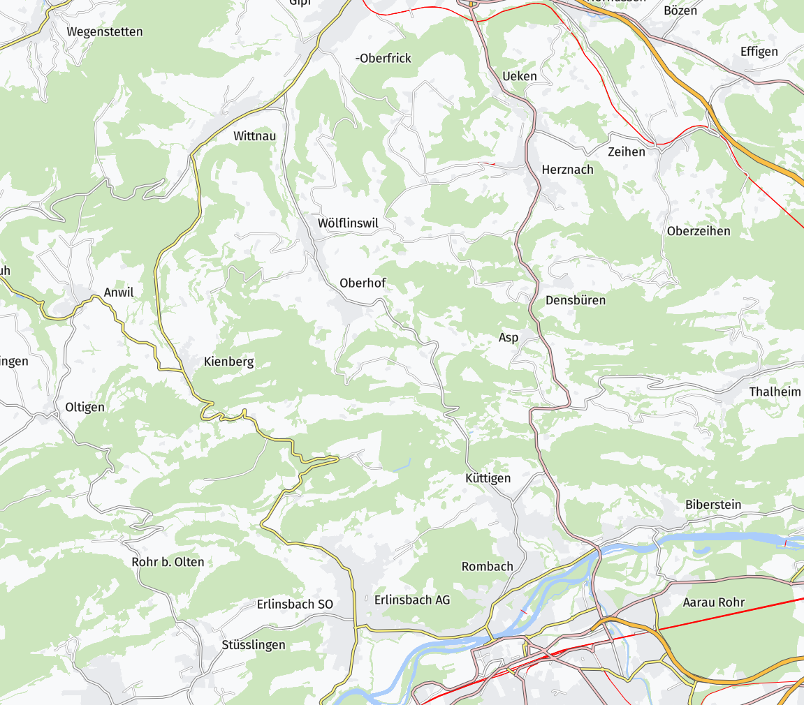

# swisstopo-smr-labels
Swisstopo raster maps labels on a MapLibre vector map.

The traditional Swisstopo raster maps at https://map.geo.admin.ch have hand-placed labels for all scales. At every scale, the labels are dense and well-placed. Here, we copy some labels into a geojson and show them on a MapLibre vector map.

With vector tiles, the labels usually stay in one location and don't move. In this example the labels jump now between zoom levels, leading maybe to some confusion while zooming. But at a given zoom level, the labels are in an optimized spot.

## demo

https://wipfli.github.io/swisstopo-smr-labels

